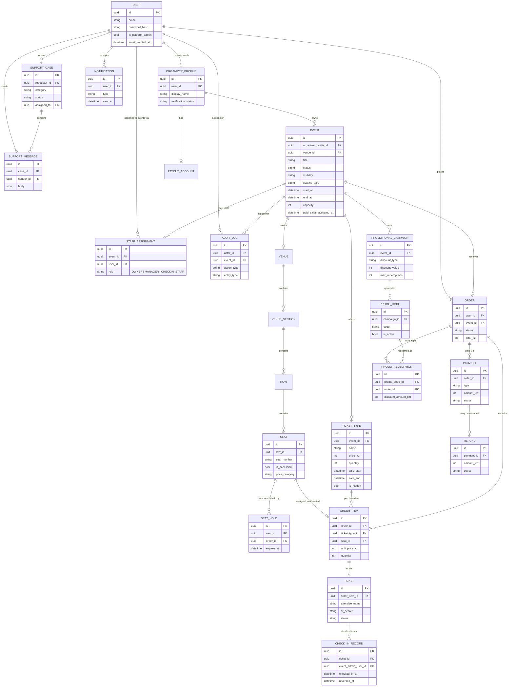

<h1 align="center">Architecture</h1>

This document describes the domain model: roles, core entities, relationships, and the reasoning behind key structural decisions. For folder-by-folder codebase layout, see the main [README](../README.md#project-structure).

## Roles & Permissions

There are two layers of authorization — don't model this as a single flat `role` field.

### Global roles (on `User`)

| Role | Notes |
|---|---|
| `user` (default) | Every registered account. Can act as an Attendee — no separate attendee flag needed. |
| `platform_admin` | Internal staff. Boolean/enum on `User`. Grants access to admin endpoints (moderation, activation review, disputes). |

### Event-scoped roles (via `StaffAssignment`)

"Organizer" and "Event Admin" are not user types — they're a relationship between a `User` and a specific `Event`. A user can be `OWNER` on one event and `CHECKIN_STAFF` on another at the same time.

| Role (per event) | Capabilities |
|---|---|
| `OWNER` | Created the event. Full control: edit, publish, cancel, activate paid sales, manage staff, refunds. |
| `MANAGER` | Organizer-invited co-manager. Same as `OWNER` minus destructive/financial actions. |
| `CHECKIN_STAFF` | The "Event Admin" from the SRS. Mobile app only: scan/verify/check-in for assigned events. |

**Enforcement:** a FastAPI dependency, `require_event_role(event_id, allowed=[...])`, loads the event, checks `StaffAssignment` for `(user_id, event_id)`, and falls back to a `platform_admin` bypass where the SRS allows it. Almost every organizer-facing endpoint depends on this — it's foundational, built early.

## Core Entities

Grouped by domain module:

- **Identity** — `User`, `OrganizerProfile`, `PayoutAccount`
- **Events & Venue** — `Event`, `Venue`, `VenueSection`, `Row`, `Seat`, `StaffAssignment`
- **Ticketing & Orders** — `TicketType`, `SeatHold`, `Order`, `OrderItem`, `Ticket`, `Payment`, `Refund`
- **Check-in** — `CheckInRecord`
- **Support** — `SupportCase`, `SupportMessage`
- **Promotions** — `PromotionalCampaign`, `PromoCode`, `PromoRedemption`
- **Platform-wide** — `Notification`, `AuditLog` (append-only, never editable via API)

### Invariants to keep in mind when implementing these

- A `Ticket`'s QR encodes an opaque/signed token, never the raw DB id — the verification endpoint looks it up server-side.
- Seat purchase is atomic: `SELECT ... FOR UPDATE` on the seat row inside the order transaction (or a unique constraint on active hold/sold state), so two concurrent checkouts can't win the same seat.
- Discounts (promo codes, campaign QR codes) are always computed server-side — never trusted from the client.
- `Ticket.status` transitions are one-way except explicit, authorized reversal (e.g. undoing a check-in), not a generic update endpoint.

## ERD

This diagram renders automatically on GitHub. If you edit it, keep this file as the single source of truth — don't let a separate copy drift out of sync.

## Key Design Decisions

- **Modular monolith, not microservices** — one deployable service, internal domain boundaries by folder.
- **Roles are two-layered** (global + event-scoped) rather than one enum — see [Roles & Permissions](#roles--permissions).
- **Postgres handles concurrency directly** (row locks, unique constraints on seat state) rather than introducing Redis on day one. Caching can be added later without a redesign if it becomes necessary.
- **Sync DB URL for Alembic, async for the app** — migrations run once, sequentially, so there's no reason to write async migration scripts; `psycopg2` for Alembic, `asyncpg` for the running app, same Postgres.